# AI-Image-Detector
UC San Diego CSE 151A: ML Learning Algorithms Final Project

# Link to Milestone5/ Final jupyter notebook:  
https://github.com/kyrafetter/ai-image-detector/blob/main/notebooks/.ipynb_checkpoints/Milestone5-Final-checkpoint.ipynb

# Milestone 5/ Final Submission:

## Introduction

Recent advances in generative AI technology, with the development and release of models such as DALL-E 3 and MidJourney, have led to an explosion of AI-generated images on social media platforms, making it increasingly difficult to trust the authenticity of posts. This proliferation of synthetic images has significant implications for the spread of misinformation and fake content, especially during critical periods such as elections. Our team is particularly concerned about the potential influence of AI-generated images on public opinion and their ability to cause confusion, particularly among the older generation, who may be more susceptible to trusting such content. Furthermore, in artistic spaces like r/wallpapers and other forums, the rising number of AI-generated submissions, often without proper tagging or disclosure, has sparked concerns about devaluing human creativity and effort.

Example of AI generated image that is misinterpreted by the public:
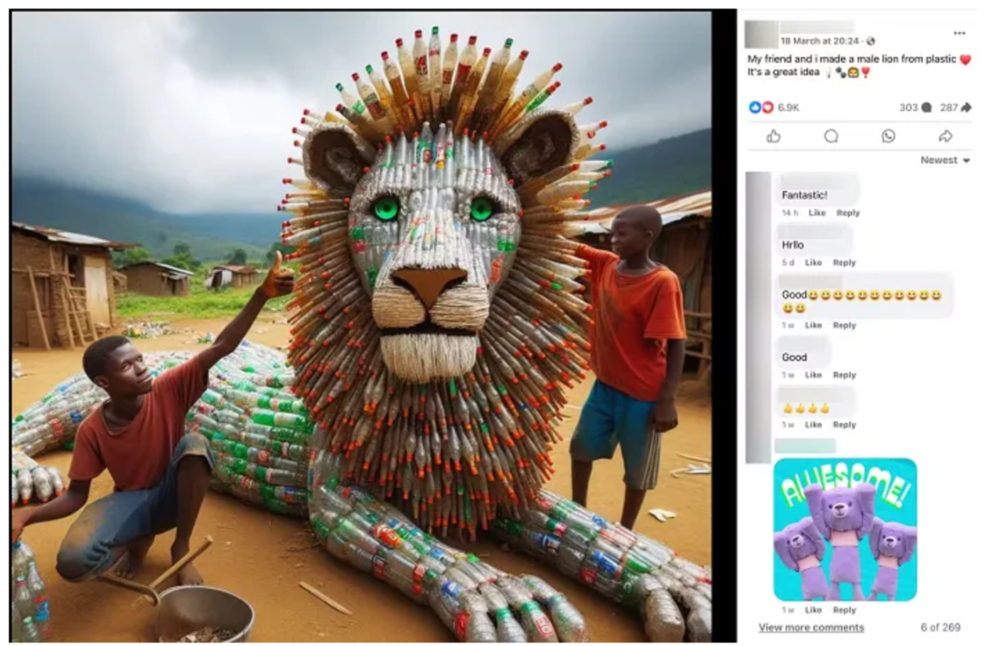

To address these challenges, we developed a machine learning model leveraging convolutional neural networks (CNNs) and computer vision techniques to classify images as either AI-generated or real. Such a model has the potential to enable automatic tagging of AI-generated images on social media and art platforms, ensuring transparency and preventing users from misconstruing AI-generated content as genuine.

We utilized a Kaggle dataset comprising 30,000 real images from Pexels, Unsplash, and WikiArt, alongside 30,000 AI-generated images from Stable Diffusion, MidJourney, and DALL-E. Due to resource constraints, we selected a representative sample of 6,000 real and 6,000 AI-generated images for training and testing, focusing on various everyday objects such as animals, cars, and planes. Our preprocessing pipeline involved resizing images to a consistent dimension, normalizing pixel values to a [0, 1] range, labeling the images, and enhancing robustness through padding, Gaussian noise addition, and imputation.

Using PyTorch, we built a CNN model comprising convolutional layers for feature extraction, max pooling for dimensionality reduction, and fully connected layers culminating in a binary classification output. Our model achieved a training accuracy of 89.16% and a testing accuracy of 87.25%. On a testing set of 1,200 observations, the model produced 517 true positives, 530 true negatives, 53 false positives, and 100 false negatives. These results demonstrate the potential of our approach in identifying and tagging AI-generated images to ensure transparency and maintain the integrity of online platforms.

## Methods 
### Data Exploration
*Class Distribution*

The bar plot below graphs the distribution of classes on our whole dataset of 12,000 images. This plot demonstrates that we have 6,000 images in each class and two separate classes, one for AI-generated images and one for real images. Therefore, we do not have class imbalance. Class 0 represents the AI-generated images and there are 6,000 AI-generated images. Class 1 represents real images and there are 6,000 real images. The class distribution as 0 and 1 was decided by the binary classifier used in our configuration setting for the Tensorflow ImageDataGenerator object which selected the first directory, fake images, in our images directory as class 0 and the second directory, real images, as our class 1.

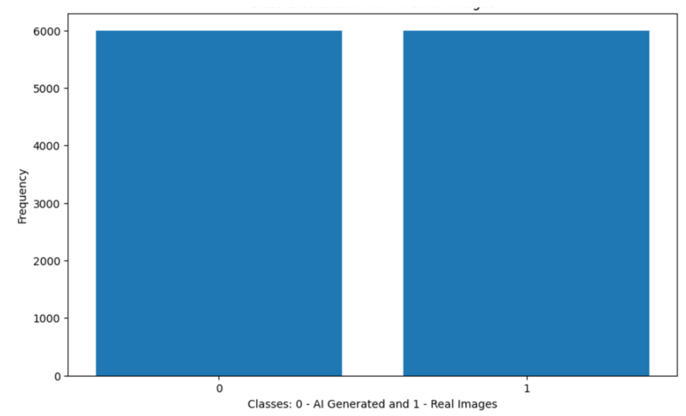

*Image Corruption*

Upon dataset exploration, we discovered that there is one image in the set of real 6,000 images under the filepath "images/real/5879.jpg" that is corrupt due to being truncated.

*Image Size*

For the consideration of image sizing and potential resizing need and strategy, we examined the distribution of image sizes. When running this analysis on our 12,000 images, we noticed some clear trends. The distribution of real images had a much larger spread when compared to that of AI, and also seems to follow two common aspect ratios (indicated by the two trend lines we see in real images).

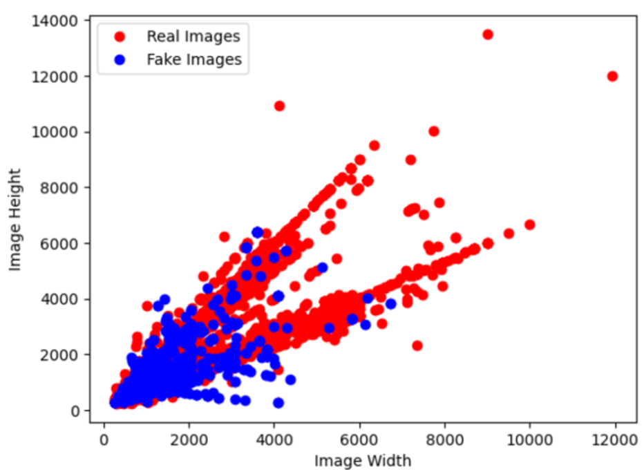

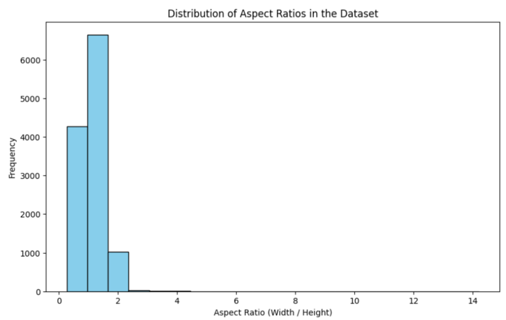

In terms of how we might consider mitigating this, we will likely be considering some form of resizing. This would need to occur regardless due to the Convolutional Neural Networks using fixed sized filters, which would likely make it difficult for the model to learn patterns; at the very least, varied sizes to actually train upon could introduce another dimension of error. However, knowing the original size may be a helpful feature, given the strong patterns we see above.

In order to resize to a consistent standard, we will consider potentially cropping images or zero padding to fit aspect ratios, which could be a standard procedure of each image prior to being fed into the model. For some images, given that we have images as large as 12000x12000 or 10000x14000, we may need to resize down to a smaller size, such as 1024x1024 or even 512x512. We may also consider adding max pooling layers inside the CNN in order to resize the image and extract information within the CNN, rather than losing image data before the CNN.

*Pixel Values*

In this analysis, we explored the distributions of color intensities for each of the three color channels (red, green, and blue) across the image dataset, comparing real images and AI-generated images.

The first figure displays the distribution (density) of each color channel across all pixels aggregated across real (solid line) and fake (dashed line) images respectively. We see that color intensity values fall within the range of 0 to 255, inclusive. All three color channels demonstrate a similar trend in that fake images seem to have a great proportion of low-valued color intensities while real images have a similar spike but at high-valued color intensities, and both share a moderate peak at around 25. This may indicate that AI-generated images tend to either be darker or are composed of more primary/solid colors compared to real images.

The next two figures show the distribution of the mean or median color intensity for a given color channel across images where the image index is on the x-axis and the color intensity is on the y-axis. Please note that intensities are sorted, hence the monotonically increasing plot. The real and AI-generated trend lines show a similar shape; however, it seems that a larger proportion of AI-generated images have slightly higher pixel intensities for the three channels in the mid-intensity range while real images have higher intensity at the ends of the intensity spectrum.

*Image Sharpness*

To analyze image sharpness quantitatively, we utilized the Laplacian method in OpenCV to emphasize areas with rapid intensity changes, which often correspond to edges and details in the image. Using cv2.Laplacian(img, cv2.CV_64F), we computed the Laplacian of each image, highlighting areas with rapid intensity changes (i.e., edges and details). Calculating the variance of the Laplacian values (via .var()) serves as an effective measure of sharpness. Higher variance suggests a sharper image, as more edges and details are present. Lower variance indicates a blurrier image with fewer intense changes in pixel values, resulting in a smoother appearance.

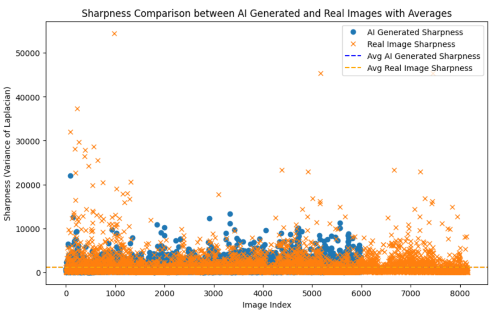

AI-generated images tended to have higher sharpness on average (indicated by a higher mean sharpness). This could imply that AI models are tuned to produce images that appear more defined or crisp. The lower standard deviation in AI-generated images implied that the sharpness is more consistent across the dataset, with fewer variations in sharpness levels compared to real images. The higher median in AI-generated images suggested that even the "middle" sharpness values in AI images are higher than those in real images, reinforcing the consistency in sharpness across AI images. This analysis suggested AI images are optimized for sharper, more consistent quality, whereas real images display a broader range of sharpness, likely due to diverse conditions in real-life photography (lighting, focus, etc.).

*Image Brightness*

We performed brightness analysis contrasting the AI-generated and real images. We iterated through each image in our dataset and converted the image to gray scale. Converting the image to gray scale allows each pixel value of the image to be a brightness value by removing the RGB color channels and converting to a single color channel. For each image, we used the mean of the pixel values for a single grayscale channel to calculate the general brightness of each image.

We computed both the mean brightness for each image in the AI-generated and real classes and the mean of each of these lists to get the general brightness of each class. Based on the bar plot and scatter plot, it seems that the real images are generally slightly brighter than the AI-generated images.

We used the lists containing mean brightness values per image per class from the previous bar graph to plot the brightness of each image differentiated by blue for real images and orange for AI-generated images. It seems that the general brightness of both classes is intermixed with no clear distinguishing factor. However, there are a few outliers in the real images that exceed the 250 mean brightness level, so it could be that real images are slightly brighter than AI-generated images.

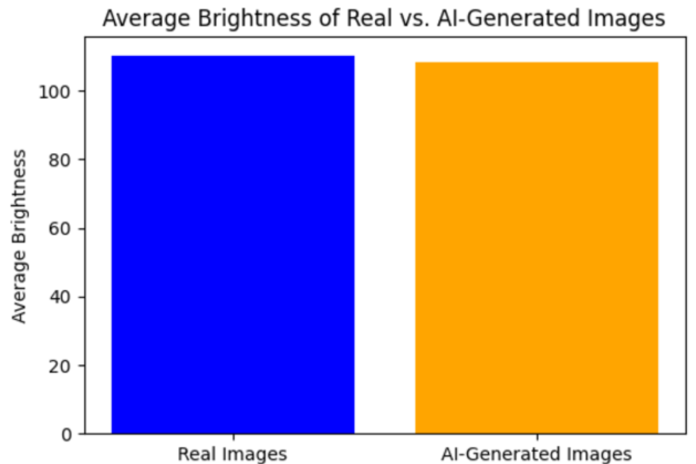

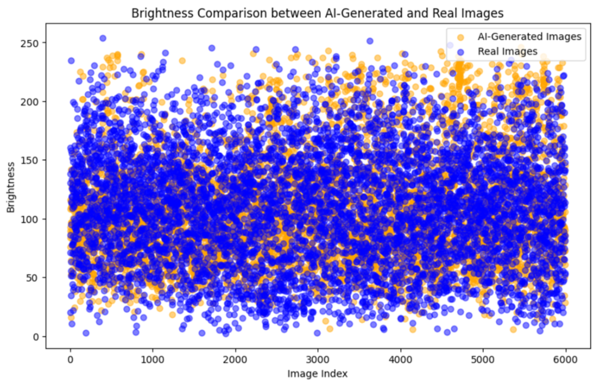

### Pre-Processing: First Model
For Model 1, we implemented pixel normalization, image zero-padding and re-sizing, and image imputation. Pixel normalization was performed using Min-Max Normalization to normalize all pixel values to 0-1 from 0-255. We preprocessed images by padding non-square images with zeros to make them square before resizing, ensuring standardized dimensions. This approach preserves the original image values, as the padding does not alter the content of the images. 

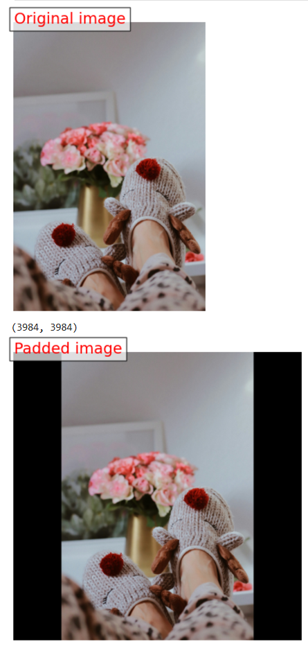

Once all images were padded to a square dimension, we applied a resizing operation to expand or shrink images to 1024*1024 pixels. For image imputation, we used inpainting to impute regions of images that were corrupted/truncated.

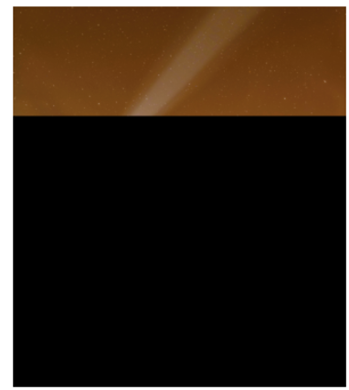

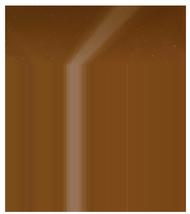

We used Tensorflow ImageDataGenerator to perform our 80-20 train test split. The ImageDataGenerator was with configurations for binary classification, normalization, and 1024*1024 re-sizing (after padding the images), to streamline our data splitting and preprocessing steps. We then built our CNN using Tensorflow.

### First Model
For model 1, we defined initial PyTorch model architecture and training, testing, and validation pipelines 5 epochs with a batch size of 32. We also added the framework for calculating metrics for precision, recall, F1, true positives, true negatives, false positives, false negatives, loss, accuracy, and graphs demonstrating changes in loss throughout model training and evaluation across iterations. This exact same model training and testing pipeline was leveraged for the entire project. We trained the model with a learning rate of 0.001 using the Adam optimizer and evaluated performance using Binary Cross Entropy Loss. The initial Pytorch model architecture is a Convolutional Neural Network (CNN) designed to classify images as either AI-generated or real. The architecture consists of three convolutional layers with 3×3 kernels and ReLU activation functions, each followed by a max-pooling layer to progressively reduce the spatial dimensions and extract hierarchical features. The first convolutional layer maps the input image's RGB channels to 32 feature maps, the second expands these to 64 feature maps, and the third further increases to 128 feature maps, capturing more complex patterns in the image. The output of the final convolutional layer is flattened into a 1D vector, which is passed through two fully connected layers to learn high-level representations and classify the image. A sigmoid activation at the output ensures the final prediction is a probability between 0 and 1, suitable for binary classification. This architecture balances complexity and computational efficiency, making it well-suited for distinguishing AI-generated images from real ones. The architecture diagram is displayed below to be replicated for future use cases.

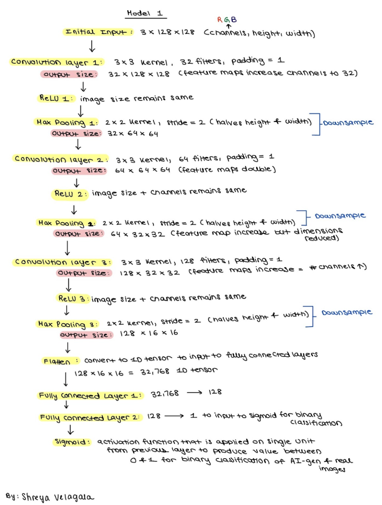

### Pre-Processing: Second/Final Model
For model 2, we injected Gaussian Noise into all images (with a scaling factor of 0.1) in order to better mimic the noise present in natural image datasets and help our model become more robust and prevent overfitting. When this modification was exclusively tested on the 30 image dataset, it seemed to help improve model accuracy, increasing accuracy from 0.60 to 0.75. This preprocessing step was performed in addition to the other preprocessing steps from model 1 with the exact same parameters, optimization, and loss function as specified in the preprocessing from the model 1 design above. 

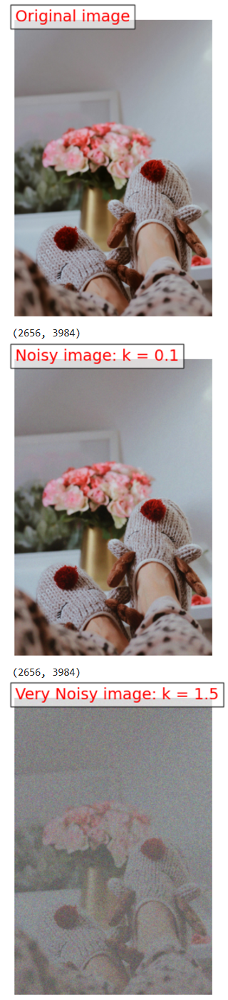

### Second/Final Model
For our second model, we added a series of improvements to specifically increase model complexity and aid with underfitting. First, we doubled the number of epochs from 5 to 10. We also implemented an adaptive learning rate that halves the learning rate at user-specified epoch numbers; a list is used to specify during which epochs the learning rate should be halved.

Three model architecture updates were made on this iteration of the model. To increase model complexity, we added more convolutional layers with more filters. Now, we have 128, 256, and 512 feature maps because of the added convolutional layers. Additionally, we tried to replicate behavior of more complex CNN models like ResNet to increase the complexity of our model. One idea we replicated from more complex architectures is Global Average Pooling (GAP). We added a layer for GAP that replaced a previous flattening layer. Finally, we also incorporated a residual/skip connection. We added a skip connection from the output of the convolutional layer x2 and the convolutional layer x5. Essentially, we projected and resized the output x2 to match the number of channels in x5 through a 1 by 1 convolutional layer. Then, we added the x_skip layer, which is the transformed layer of x_2 to x_5 so that the features from the x_2 layer are added element wise to the features from x_skip. The final model architecture can be found in the diagram attached below in order to replicate the structure of the model.

Overall Model 2 architecture breakdown:  
This enhanced model architecture (V2) is designed to improve the classification of AI-generated images by increasing model complexity and addressing underfitting. It consists of five convolutional blocks, each incorporating batch normalization for stabilizing training, ReLU activations, and max-pooling for spatial downsampling. The architecture progressively increases the number of feature maps from 32 to 512, allowing it to capture more complex and abstract features. Two additional convolutional blocks were added to improve learning capacity and reduce underfitting. A global average pooling layer replaces flattening to reduce parameters and enhance generalization. Fully connected layers then refine the learned features, with the final layer using a sigmoid activation for binary classification. A residual connection projects intermediate features from an earlier layer directly to the final convolutional block, aiding gradient flow and improving feature retention. This V2 model architecture is designed to balance complexity and efficiency, leveraging advanced techniques to classify AI-generated images more effectively. The diagram for this model architecture is displayed below.

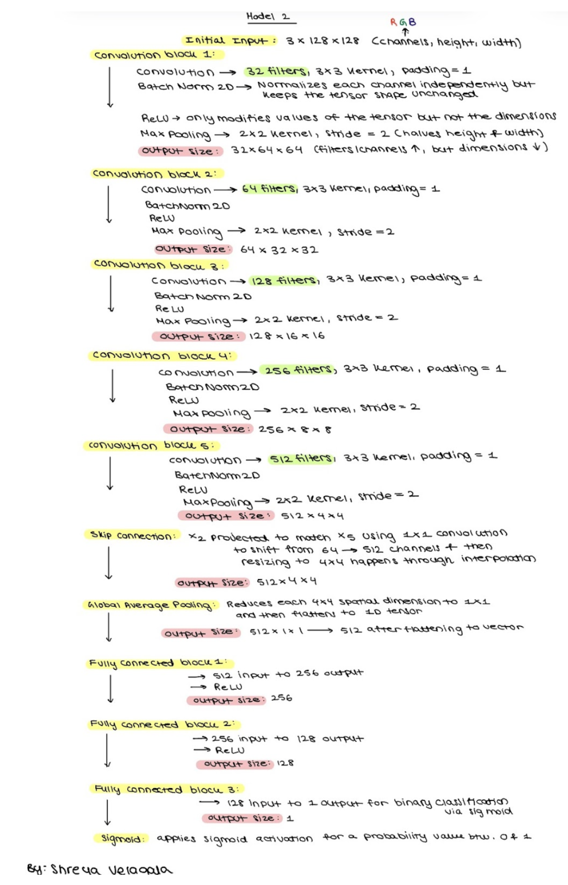

## Results
### First Model
In the first model, we implemented a robust preprocessing pipeline that included pixel normalization using Min-Max scaling (0-255 to 0-1), image zero-padding and resizing for standardized dimensions, and inpainting-based image imputation to handle corrupted or truncated regions. Our initial model architecture, developed in PyTorch, consisted of three convolutional layers with feature map sizes of 3, 32, and 64. The model was trained, validated, and tested over five epochs with a batch size of 32, yielding a total of 1,875 gradient updates during training. We evaluated the model using metrics such as precision, recall, F1-score, true/false positives, true/false negatives, loss, and accuracy, and visualized loss progression during training and validation.

Training vs Validation accuracy:
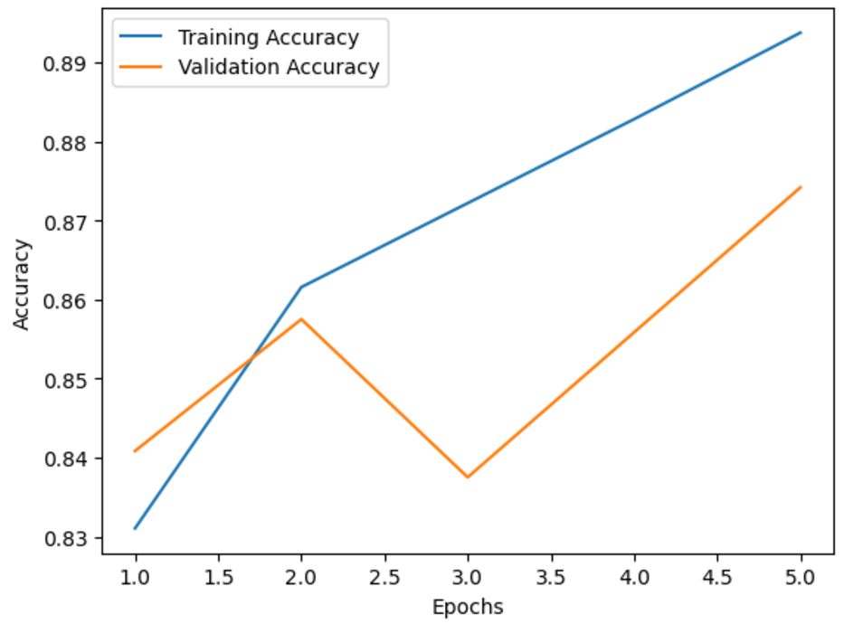

Training vs Validation loss graph:
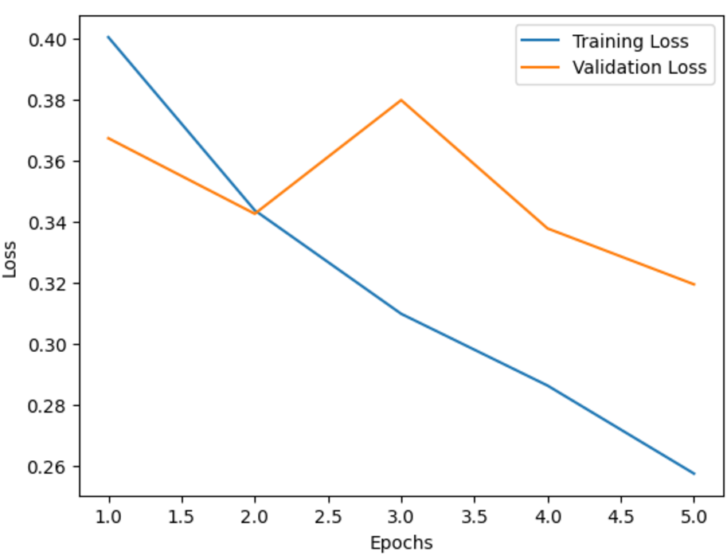

The results demonstrated strong model performance. On the training dataset, the model achieved a loss of 0.2306 and an accuracy of 90.70%, with precision, recall, and F1-score of 88.15%, 94.07%, and 91.01%, respectively. The confusion matrix revealed 4,522 true positives, 608 false positives, 4,185 true negatives, and 285 false negatives, out of a total of 9,600 training observations.

On the test dataset, the model achieved a loss of 0.2531 and an accuracy of 89.33%, with precision, recall, and F1-score of 86.34%, 93.95%, and 89.98%, respectively. The confusion matrix showed 575 true positives, 91 false positives, 497 true negatives, and 37 false negatives, from a total of 1,200 testing observations.

first model metrics:
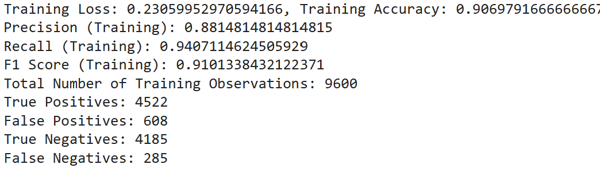

The slight differences in performance between training and test datasets highlight a well-generalized model with minimal overfitting. The high number of gradient updates during training contributed to the model's stability and optimization.

### Second/Final Model
For our second model iteration, we introduced several enhancements to improve robustness and address the underfitting observed in our initial implementation. Preprocessing improvements included injecting Gaussian noise with a scaling factor of 0.1, which better mimicked the noise in natural image datasets and reduced overfitting. This step increased model accuracy on a 30-image test dataset from 0.60 to 0.75. Additionally, the number of training epochs was doubled from 5 to 10, resulting in greater convergence in the loss curves and overall improved performance, despite computational constraints. To refine training dynamics, we implemented an adaptive learning rate that halved the rate at each step, ensuring efficient computation while avoiding oscillations in accuracy. The model architecture was significantly enhanced to increase complexity and improve feature extraction. Convolutional layers with 128, 256, and 512 feature maps were added, alongside advanced architecture concepts inspired by ResNet, such as Global Average Pooling (GAP) to aggregate spatial information and skip connections to pass information from earlier to later layers. These changes enhanced the model's ability to detect both low- and high-level features, resulting in a more nuanced understanding of the data. Although a 5-fold cross-validation approach was initially implemented to ensure robust evaluation, computational limitations led to its exclusion in this iteration. The corresponding code, however, remains available in the project repository for future use.

The second model achieved a training loss of 0.2589 and a training accuracy of 89.17%, reflecting strong performance. Precision, recall, and F1-score were 91.66%, 86.16%, and 88.83%, respectively. The confusion matrix for the training dataset showed 4,134 true positives, 376 false positives, 4,426 true negatives, and 664 false negatives out of 9,600 observations. On the test dataset, the model achieved a loss of 0.3086 and an accuracy of 87.25%. Precision, recall, and F1-score were 90.70%, 83.79%, and 87.11%, respectively. The confusion matrix revealed 517 true positives, 53 false positives, 530 true negatives, and 100 false negatives out of 1,200 testing observations.

second model metrics:
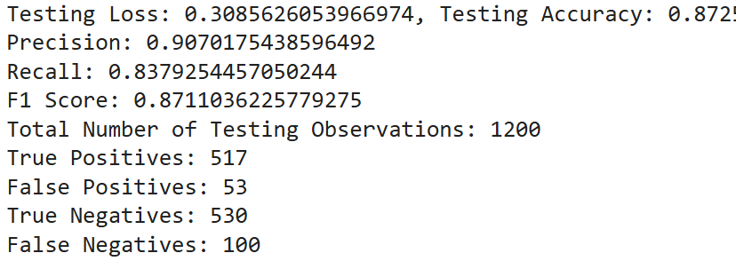

The fitting graph showed that training and validation losses began to converge toward the later epochs, reflecting reduced underfitting and improved generalization compared to the first model. However, there remains a slight gap between training and testing performance, suggesting the potential for further tuning. Hyperparameter optimization was performed to refine model performance, particularly focusing on learning rate scheduling, batch size adjustments, and the number of epochs. These efforts were designed to balance the trade-offs between convergence speed and the model's capacity to generalize effectively across datasets.

Training vs Validation accuracy:
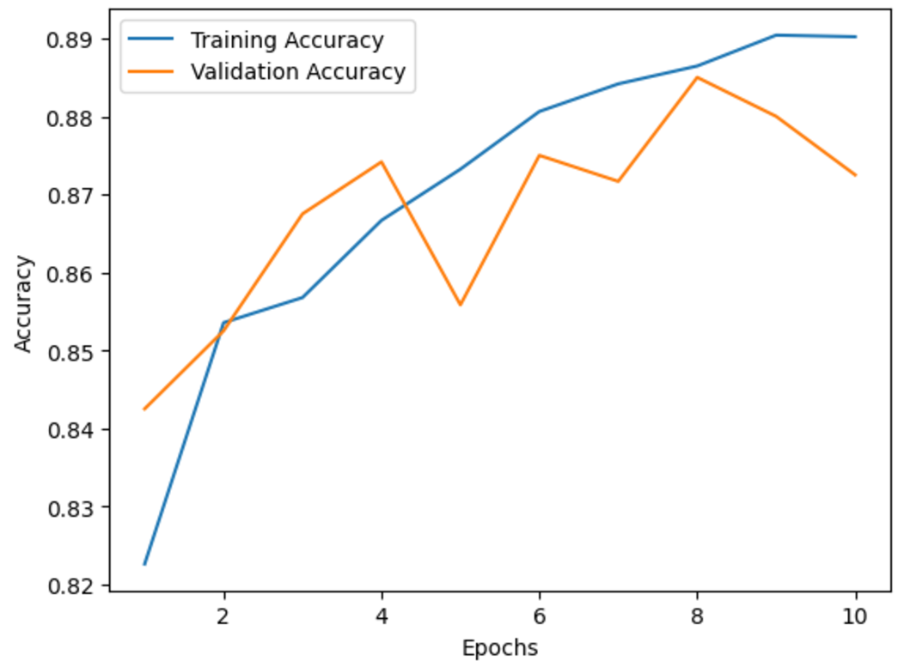

Training vs Validation loss:
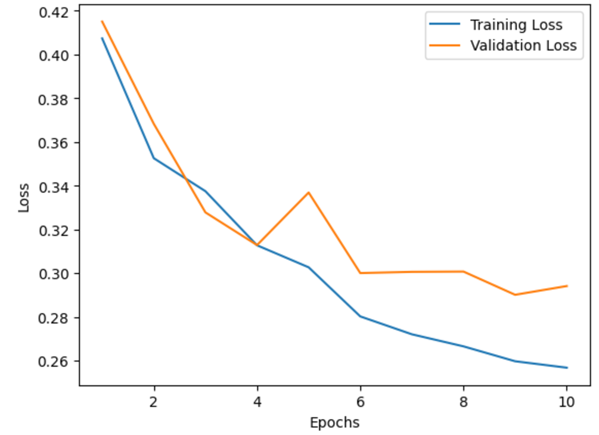

To further improve the model, we plan to expand the training epochs to allow the model to better learn the added noise and achieve higher performance, adjust the adaptive learning rate schedule to better accommodate extended training, and augment the dataset with additional transformations such as flips and rotations to enhance feature detection. Further architectural modifications, such as introducing additional skip connections and re-evaluating the GAP layer versus flattening, may also optimize feature extraction. These strategies, combined with continued hyperparameter tuning and analysis of the fitting graph, aim to build on the strong foundation of the second model and address the slight performance gaps observed, ensuring better robustness and generalization in subsequent iterations.

## Discussion

### Overview
For our project, our initial decision to build a CNN-based model for AI image detection was driven by the idea that a more complex model may be needed in order to discern differences between the image classes properly. We felt that a CNN-based model would allow for the learning of much more complex features vs other models, such as logistic regression or others, due to the convolution of the images being performed.

### Pre-Processing

#### Imputation
As mentioned in our methods, we did need to impute a corrupted image in order to have our model accept it and not crash. We chose to impute rather than swap an image, as we felt this would maintain the general distribution of image types in the dataset. This of course did come with the cost of introducing an image which may be less-than-representative of a normal real image, potentially introducing data bias in a different manner. We feel that, given the large sample of images and random distribution of train, validation, and test, any potential risk of bias would not be large for our results.

#### Resizing
After performing a sizing analysis, we noticed our images are of varying non-square shapes. Hence, in order for the batch processing of images in our CNN to work effectively, we resize our images to uniform size. This may cause some loss in image information, however, since our images are of varying sizes and tend to be relatively large, resizing the images to be smaller is a critical step for running the CNN; we seemed to still see reasonably good model performance regardless. Additionally, because the AI generated images tend to have color, sharpness, and brightness differences from real images, we believe that losing some image information should not prevent detection of these differentiating factors between images.

#### Normalization
In our analysis, we noticed that our images have slight brightness, sharpness, and RGB differences between AI generated and real images. In order for these differences to be effectively and clearly differentiated by our CNN, we chose to normalize the RGB values of the pixel values. This also ensures that we work with smaller gradients during backpropagation allowing CNNs to train faster and more effectively as input data has a consistent and smaller scale. Finally, because we have brightness and color variations between AI generated and real images, normalizing the RGB values reduces the effect of these differences allowing the CNN to learn meaningful patterns along with intensity variations across the dataset rather than fully relying on brightness and RGB.

#### Guassian Blur
We added Gaussian blur to our images to contribute to a more robust model training process. This better mimics the noise present in natural image datasets and helps our model become more robust and prevent overfitting.

### Model Contruction/ Architecture

For our first model iteration, we chose to maintain a simple model with only a few layers for simplicity sake, and this yielded good performance. In our second model, we hoped to increase the complexity of the model to learn more features, potentially allowing us to better learn differences between real and fake images. We ended up seeing a slight decrease in model performance, which we attribute to the addition of Gaussian noise requiring more epochs for effective learning, along with potentially premature adjustments in the adaptive learning rate, both of which could have impacted the overall performance, especially without additional tuning. Nevertheless, the model exhibited greater loss convergence, as reflected in the flattening of training and validation loss curves, indicating reduced underfitting.

For our final model, we made a series of improvements to increase the complexity of our model to help with underfitting. The first change we made is adding more epochs. We doubled the number of epochs from 5 to 10 in order to try and have more convergence in our loss, and achieve a higher accuracy without underfitting.

We also implemented an adaptive learning rate which seeks to help the model fine-tune its learning and avoid potential oscillating accuracy with higher epoch numbers. Given that our epoch count is relatively lower, we decided to halve the learning rate at each step, in order to not make the training too dramatically slow. If this model were to be run on a computing cluster or similar, with higher epoch counts, this adaptive learning rate could potentially be tuned to be a much sharper dropoff, albeit at later epochs. It is also worth mentioning, the lower epoch count is somewhat less concerning, given that our large training data set leads to 375 gradient updates per epoch or 3750 total across 10 epochs (as discussed in Milestone 3), so there are still a large number of gradient updates occuring, just not with the full dataset.

Three model architecture updates were made on this iteration of the model. Firstly, we realized that our previous model was underfitting, so we need to make architecture updates that would increase model complexity and allow the model to see more complex features. To increase model complexity, we added more convolutional layers with more filters. Now, we have 128, 256, and 512 feature maps because of the added convolutional layers. Additionally, we tried to replicate behavior of more complex CNN models like ResNet to increase the complexity of our model. One idea we replicated from more complex architectures is Global Average Pooling (GAP). We added a layer for GAP that replaced a previous flattening layer. We decided to use GAP because it would allow the model to focus on global patterns in each image by aggregating spatial information across the feature map. Finally, we also incorporated a residual/skip connection. We added a skip connection from the output of the convolutional layer x2 and the convolutional layer x5. Essentially, we projected and resized the output x2 to match the number of channels in x5 through a 1 by 1 convolutional layer. Then, I added the x_skip layer, which is the transformed layer of x_2 to x_5 so that the features from the x_2 layer are added element wise to the features from x_skip. The goal with adding this skip connection is to ensure that information from earlier layers is passed forward to the later stages of the network so that the model can learn more low-level features for the earlier layers and allow feature reuse without creating too large of a network. The model architecture can be found in the diagram attached below in order to replicate the structure of the model.

Overall, the most important feature we felt impacted our model performance with the epoch number. Our first model did surprisingly well with only 5 epochs, but the added complexity of the second model may have meant that more epochs would have helped, especially in tweaking the learning rate; changing the learning rate in the early epochs may have contributed to slower learning, hence potentially reduced performance. The main limitation of the epoch count was hardware constraints, as we did not get the chance to run the model on higher performance hardware. Despite these limitations, however, we still felt our model was performing well, and could certainly improve with improvements such as epoch count, learning rate tweaking, etc. to learn the added noise and allow the model to be more robust.

## Conclusion

For future directions, we would like to increase the size of our training dataset. Due to computational restraints, we used a subset of the original Kaggle dataset of 12,000 images, split 80-20 for training and validation. We predict that we may be able to achieve higher validation accuracy if we can increase the number (and thus diversity) of images in the training set.

Additionally, we would like to train our model using more epochs in order to give the model more time to reach a global loss minimum. Due to computational resource limitations, we were only able to run approximately 10 epochs and saw some evidence of underfitting. Therefore, it would be advantageous to run at least 20 epochs when performing model training.

Given these future directions, we feel that the most immediate next step would be to translate our current local set-up to a computer cluster like the SDSC in order to be able to access the computational resources required for these more computationally demanding tasks.

We also attempted to implement K-Fold Cross-Validation during milestone 4 via a 5-fold cross-validation approach. By incorporating this method, we aimed to enhance the generalization capability of our model and provide a fair assessment of its performance across diverse data subsets. However, K fold cross validation seemed to exceed computational capacity by taking over 15 hours to run (the run could not be completed). We were not sure if there may have been some issue with K-fold interacting with our model, so decided to remove it due to time constraints and only proceed with the modifications listed above. Therefore, in future iterations of this project, it would be interesting to look at implementing K fold cross validation again (our code for K fold clustering is at the bottom of the MS4 notebook for reference on potential future iterations).

Additionally, our model right now only incorporates some aspects of complex model architectures like ResNet, which are more frequently used for image segmentation and image classification tasks. Currently, our model only has several convolutional layers and one residual layer, we would like to possibly incorporate more complex model layers and architecture design similar to ResNet to improve our model complexity and applicability to the AI generated image classification task in the future.

In the age of generative AI, it has become increasingly necessary to be able to differentiate between AI-generated images and real images, particularly in the realm of social media platforms, with important implications in misinformation spread and proper credit attribution. In response, our team has developed a preliminary machine learning model leveraging a CNN model architecture to perform binary classification on image input to determine if images are synthetic (AI-generated) or real. While future work is needed to more robustly train the model, we believe that the model we present here provides a notable first step towards being able to accurately differentiate between synthetic and real images in the public sphere.

## Statement of Collaboration

Overall, most tasks were done as a collective group or agreed upon as a collective group. We would frequently meet in order to touch base and distribute how we should make progress with the project, assigning components as needed. We did not explicitly assign roles such as leader, manager, writer, etc, but rather generally had people work on various sections of the project, and contribute to different sections of the writeups/ other logistics. Some person-specific contributions are listed below.

Aatash Pestonjamasp:
* Investigation into image sizing and distribution across both classes
* Joining together sections of notebook
* Contributions on Readme sections
* Model progress recovery implementation
* Randomized dataset splitting implementation
* Investigating varied epoch numbers for training
* Adding adaptive learning rate
* Running model training and analysis

Shreya Velagala:
* Image brightness and sharpness analysis across both classes for exploratory data analysis
* Designed and implemented model architecture and data loading pipeline with PyTorch and the initial Tensorflow model
* Designed and implemented a complete evaluation pipeline for training and testing with testing, training, validation loss and precision, recall, FP, FN, TP, TN metrics
* Revamped model architecture for model 2 using global average pooling, increasing convolutional layers, and adding residual connections
* Created diagrams for convolutional neural networks
* Organized team meetings and allocated team tasks

Kenzo Ku:
* Conducted exploratory data analysis focusing on image sharpness for both AI and real images
* Ensured uniform image dimensions by implementing zero-padding
* Reduced risk of overfitting by testing across diverse splits, using k-fold cross validation method where k=5
* Implemented data augmentation to increase the size and diversity of the dataset
* Readme sections contribution

Kyra Fetter:
* Initial drafts of the project abstract
* Exploration of image corruption and RGB color analysis for both classes for the Data Exploration milestone
* Implemented image imputation to recover corrupted images in the dataset
* Implemented Gaussian noise injection as an additional pre-processing step for Model 2
* Contributions to the README for all milestones
* Organized team meetings and attended office hours to ask project questions where necessary

# Milestone 4:

## Milestone Updates

* **Preprocessing- Guassian Noise:** For this model revision, we injected Gaussian Noise into all images (with a scaling factor of 0.1) in order to better mimic the noise present in natural image datasets and help our model become more robust and prevent overfitting. When this modification was exclusively tested on the 30 image dataset, it seemed to help improve model accuracy, increasing accuracy from 0.60 to 0.75.

* **More Epochs:** For this model revision, we doubled the number of epochs from 5 to 10 in order to try and have more convergence in our loss, and achieve a higher accuracy, as recommended previously. While the model performance may still benefit from additional epochs- we haven't been able to run for additional epochs due to high runtime from computing hardware constraints- We did see some improvement in accuracy over last model.

* **Adaptive Gradient:** This model revision, we implemented an adaptive learning rate which seeks to help the model fine-tune its learning and avoid potential oscilating accuracy with higher epoch numbers. Given that our epoch count is relatively lower, we decided to halve the learning rate at each step, in order to not make the training too dramatically slow. If this model were to be run on a computing cluster or similar, with higher epoch counts, this adaptive learning rate could potentially be tuned to be a much sharper dropoff, albeit at later epochs. It is also worther mentioning, the lower epoch count is somewhat less concerning, given that our large training data set leads to 375 gradient updates per epoch or 3750 total across 10 epochs (as discussed in Milestone 3), so there are still a large number of gradient updates occuring, just not with thefull dataset.

* **Model Architecture:**
Three model architecture updates were made on this iteration of the model. Firstly, we realized that our previous model was underfitting, so we need to make architecture updates that would increase model complexity and allow the model to see more complex features. To increase model complexity, we added more convolutional layers with more filters. Now, we have 128, 256, and 512 feature maps because of the added convolutional layers. Additionally, we tried to replicate behavior of more complex CNN models like ResNet to increase the complexity of our model. One idea we replicated from more complex architectures is Global Average Pooling (GAP). We added a layer for GAP that replaced a previous flattening layer. We decided to use GAP because it would allow the model to focus on global patterns in each image by aggregating spatial information across the feature map. Finally, we also incorporated a residual/skip connection. I added a skip connection from the output of the convolutional layer x2 and the convolutional layer x5. Essentially, I projected and resized the output x2 to match the number of channels in x5 through a 1 by 1 convolutional layer. Then, I added the x_skip layer, which is the transformed layer of x_2 to x_5 so that the features from the x_2 layer are added element wise to the features from x_skip. The goal with adding this skip connection is to ensure that information from earlier layers is passed forward to the later stages of the network so that the model can learn more low-level features for the earlier layers and allow feature reuse without creating too large of a network.

* **K-Fold Cross-Validation (k = 5):**
To ensure the robustness and reliability of our model evaluation, we implemented a 5-fold cross-validation approach. This method allows us to assess model performance across multiple data splits, reducing the risk of overfitting to a specific subset of data and providing a more generalized measure of accuracy. By incorporating this method, we aimed to enhance the generalization capability of our model and provide a fair assessment of its performance across diverse data subsets. However, K fold cross validation seemed to exceed computational capacity by taking nearly 15 hours to run. We were not sure if we implemented K fold wrong, so decided to remove it due to time constraints and only proceed with the modifications listed above. However, we left our code for K fold clustering at the bottom of the MS4 notebook for reference on future iterations.

## Milestone Questions

### 2. Evaluate your model and compare training vs. test error

Our model performs well currently, having the training error slightly less than the test error. As discussed previously, we believe our large number of gradient updates (375 per epoch) contributes to this.

### 3. Where does your model fit in the fitting graph? and What are the next models you are thinking of and why?

Our model is now on the slightly higher complexity end of the fitting graph where our training error is slightly lower than our testing error. However, with this model compared to our previous model, we are seeing more convergence because our loss graph between training and validation depicts a flattening of both curves toward the end indicating our model is not underfitting as much as before. This could be because of the slightly improved complexity of our model. For future models, we are thinking of modifying our training data more by having random flips or rotations of images to increase noise in our images for lower level features to be detected. We also want to improve model architecture by introducing more skip connections and maybe removing the global average pooling layer to see if just flattening the results allows us to have better detection of spatial features. Finally, we might want to train on more epochs, however, our computers do not have computational capacity for more than 10 epochs, so we might need to use SDSC.

### 5. Conclusion section: What is the conclusion of your 2nd model? What can be done to possibly improve it? Note: The conclusion section should be it's own independent section. i.e. Methods: will have models 1 and 2 methods, Conclusion: will have models 1 and 2 results and discussion.

We see that our second model appears to perform well as stated in above. Our training accuracy is around 0.8916 and our testing accuracy is around 0.8725, so the model is performing well on training and testing with a slightly better peformance on training. With our second model, we also noticed more convergence because the training and validation loss graphs are becoming more stagnant over time. We did also notice a slight drop in accuracy compared to our first model on train and test, which we believe could be due to the added noise requiring more epochs to be learned well (but may lead to a more robust model), or potentially the adaptive gradient changing the learning rate too early (this would also benefit from more epochs). As stated above, to increase performance and model complexity, we will change our model architecture and process our features more next time (with the strategies listed in the previous section).

### 6. Provide predictions of correct and FP and FN from your test dataset.

* Total Number of Testing Observations: 1200
* True Positives: 517
* False Positives: 53
* True Negatives: 530
* False Negatives: 100
* Predictions can also be seen in the Milestone4-checkpoint.ipynb notebook.

# Milestone 3:

## Milestone Updates

* **Pre-Processing-Overall :** In regard to pre-processing, we have implemented the steps that we proposed in Milestone 2. This includes pixel normalization, image zero-padding and re-sizing, and image imputation.
* **Pre-Processing- Normalization:** For pixel normalization, we used Min-Max Normalization to normalize all pixel values to 0-1 from 0-255.
* **Pre-Processing- Padding:** In our project, we preprocess images by padding them with zeros to make them square before resizing, ensuring standardized dimensions. This approach preserves the original image values, as the padding does not alter the content of the images.
* **Pre-Processing- Imputation:** For image imputation, we used inpainting to impute regions of images that were corrupted/truncated.
* **Model Architecture:** Defined initial PyTorch model architecture and training, testing, and validation pipelines 5 epochs with a batch size of 32. Also added code for calculating metrics for precision, recall, F1, true positives, true negatives, false positives, false negatives, loss, accuracy, and graphs demonstrating changes in loss throughout model training and evaluation across iterations.
*  **Model testing:** Added plots of model accuracy and loss across the training and validation datasets. Also evaluated the training and test sets on the trained model and generated resultant performance metrics.

## Milestone Questions

### 3. Compare training vs. test error analysis

Generally, we see that our model performs well. This is due to the fact that we have 12,000 images and a batch size of 32, so we have 12,000/32 * 5 = 1875 gradient updates across the 5 epochs for our training data.

### 4. Answer the questions: Where does your model fit in the fitting graph? What are the next models you are thinking of and why?

We can see that the training has higher metric performance (please see above two cells for losses and metrics), however the testing metrics are also reasonably close and performing well. Due to this, we do not believe the risk of overfitting to be too high. Since we have other parameters we can modify (discussed below), we may still be able to decrease the loss of both training and test data sets. In other words, we may still have room to increase model complexity without overfitting.

In terms of next models, we may consider tweaking model parameters and structure (see more below).

### 6. Conclusion section: What is the conclusion of your 1st model? What can be done to possibly improve it?

We saw that our inital model appears to perform quite well. As stated above, to increase the performance, we will consider changing model architectural and runtime features for our next iteration. These improvements may include:

* **More epochs:** Training for more epochs would allow the model to continue learning, as the first couple of epochs will be needed just to reach a reasonable degree of accuracy, given the the model is randomly initialized. This is especially relevant because we chose to zero-pad non-square images so training for more epochs will enable the model to learn to ignore the zero-padding and to not use this feature when performing predictions.\
 

* **Adaptive learning rate:** Combined with a larger number of epochs especially, an adaptive learning rate (or at least one which changes throughout training a few times) may improve model performance. As the model gets increasingly accurate during epochs, a reduction in learning rate allows it to learn more slowly and not skip over a potential minimum.\
 

* **Increase training dataset size:** Right now we include 9600 images in our training dataset, and 1200 in our validation and test sets respectively, for a total of 12000 images across the three datasets. Because we have access to 60000 total images in our Kaggle dataset, we can increase the size of our train, validation, and test datasets to give the model more data to work with while training, and potentially increase it's ability to make more nuanced predicitions on unseen data.\
 

* **Randomize training data order:** We can randomize the order of the images in the training dataset, reshuffling between epochs, to avoid potential minor baises that may arise through the training data order.\
 

* **Model Architecture:** We plan on adding more convolutional layers to our model. Currently, we only have three convolutional layers that have feature maps of sizes 3, 32, and 64. We would like to add another convolutional layer for 128 feature maps so we can extract more abstract features from our images deeper in the model. We may also add model layers that consider brightness and sharpness of the images because in our exploratory data analysis, we observed variations in brightness and sharpness between AI generated and real images. We would like to distinguish these features further using model layers that address these features specifically.
 

* **K-fold Cross Validation:** K-fold cross-validation helps improve our CNN model by providing a robust evaluation of its performance across different subsets of the data, ensuring it generalizes well to unseen images. By training on multiple folds and averaging results, it reduces the risk of overfitting or underfitting specific data splits, leading to more reliable model tuning and selection. \
 

* **Regularization:** We also plan to use regularization to help our model avoid overfitting. For example, we can use adversarial regularization to train the model not only with natural training data images but also perturbed data. By intentionally confusing the model with these perturbed images, we will encourage our model to become robust against adversarial perturbation and increase model performance.\
 

# Milestone 2: Preprocessing Data Plan:  

### 1 - Imputing Corrupt Image:  
We have one image in the set of real 6k images under the filepath "/Users/shrey/ai-image-detector/data/.ipynb_checkpoints/images/real/5879.jpg"  
that is corrupt due to being truncated halfway. We have three options for cleaning up this image. One option is to impute the image with another real image from online, another is to replace the image with another real image from the remaining images in the dataset because we are only using 12k of the 60k images, or remove the image from the dataset completely. We have decided to proceed with replacing the image with another real image from the portion of the kaggle dataset we are not using due to compute resource limiations. Taking this approach would allow us to maintain 6k images in the real images and 6k in the fake images, making the classes balanced. This would also ensure that the imputed image is not an outlier because the image would be coming from the same source dataset.  

### 2 - Resizing and Padding the Images:  
After performing a sizing analysis, we noticed our images are of varying non-square shapes. Hence, for batch processing/simultaneously processing groups of images in our CNN to work effectively, we need to resize our images to uniform size.  
a - Our largest images are in the 10000-14000 range, which are too large for a CNN with minimal computational capacity to process. Therefore, we will be replacing the largest outlier images with smaller images from the unused images in the remaining portion of the 60k dataset.  
b - We plan to resize our images to 1024 * 1024 pixels, so we will pad images smaller than this size to be 1024 * 1024 in order for these images to be used in batch processing with the remaining images. This could introduce noise to our CNN by having empty portions in our images, but this is the only process for us to maintain balance between the varying image dimensions in our dataset as we have both large and small images.   
c - Any images that are non-square and larger than 1024 * 1024 will be resized to 1024 * 1024. This may cause some loss in image information, however, since our images are of varying sizes and tend to be relatively large, our only option is to resize the images to be smaller with the limited timeframe and compute resources we have for the execution of our project. Additionally, because the AI generated images tend to have color, sharpness, and brighntess differences from real images, we believe that loosing some image information should not prevent detection of these differentiating factors between images.  

* Note: We chose 1024 by 1024 because this is a common size that CNN kernels can handle effectively with limited computate resources and because a significant amount of our images cluser around the 2000 by 2000 pixel range.  

### 3 - Normalizing the Images RGB pixels:  

In our analysis, we noticed that our images have slight brightness, sharpness, and RGB differences between AI generated and real images. In order for these differences to be effectively and clearly differentiated by our CNN, we plan to normalize our RGB values to 0 - 1 rather than 0 - 255. We want to normalize the image size because this allows the model to learn from features that are at a consistent scale, improving its ability to generalize and recognize patterns. Normalizing RGB values also ensures that we work with smaller gradients during backpropagation allowing CNNs to train faster and more effectively as input data has a consistent and smaller scale. Finally, because we have brightness and color variations between AI generated and real images, normalizing the RGB values reduces the effect of these differences allowing the CNN to learn meaningful patterns along with intensity variations across the dataset rather than fully relying on brigthness and RGB.  

* Note: We chose normalization over standardization because normalized pixel valuesin the range [0, 1] are easier to interpret for the CNN as they align well with the original image structure.  

### 4 - Train Test Split Using Tensorflow ImageDataGenerator:  

We will use the Tensorflow ImageDataGenerator to perform our 80-20 train test split. The ImageDataGenerator will also be set with configurations for binary classfication, normalization, and 1024 by 1024 sizing (post padding the images), to streamline our data splitting and preprocessing steps. We will then build our CNN using Tensorflow.  

